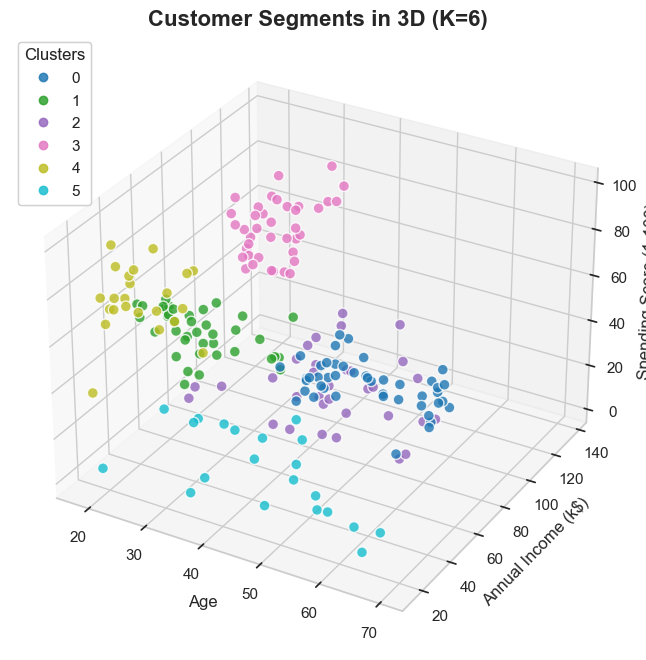
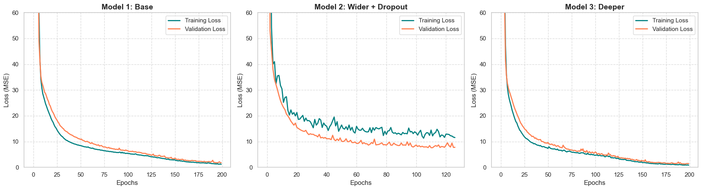
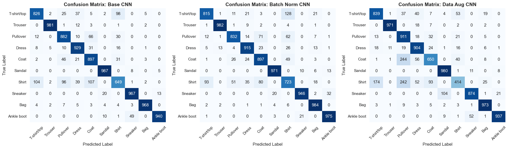

# Comprehensive Machine Learning & Data Science Portfolio

Welcome to my Machine Learning portfolio! This repository contains a series of seven end-to-end data science projects that tackle real-world business problems across various industries, including e-commerce, telecommunications, real estate, energy, media, and fashion.

## Project Overview

This project progresses from foundational Exploratory Data Analysis (EDA) to advanced Deep Learning and Natural Language Processing (NLP). The primary focus is not just on building highly accurate models, but on translating mathematical outputs into actionable business strategies and engineering solutions.

## Key Highlights & Visuals

* **Customer Segmentation (K-Means):** Identified 6 distinct buyer personas for targeted marketing.
    * **
* **Predictive Maintenance/Energy (ANN):** Built deep neural networks to predict HVAC cooling loads, implementing Early Stopping and Dropout to prevent overfitting.
    * **
* **Computer Vision (CNN):** Developed image classification models with Batch Normalization and Data Augmentation to categorize apparel.
    * **
* **Natural Language Processing (Transformers):** Fine-tuned DistilBERT to classify movie review sentiment, comparing its deep linguistic context against a traditional TF-IDF baseline.

## Repository Structure
* `data/` - Contains all datasets used in the analyses.
* `outputs/` - Contains all generated plots and visualisations.
* `main.ipynb` - The primary Jupyter Notebook containing all Python code, modeling, and evaluations.
* `tasks.md` - A detailed breakdown of the 7 specific business problems solved in this repository.
* `Report.docx` - The full APA 7 formatted technical report including methodologies, metrics, and business recommendations.

## Technologies Used
* **Languages:** Python
* **Data Manipulation:** Pandas, NumPy
* **Visualization:** Matplotlib, Seaborn
* **Machine Learning:** Scikit-Learn
* **Deep Learning & NLP:** TensorFlow, Keras, PyTorch, HuggingFace Transformers
